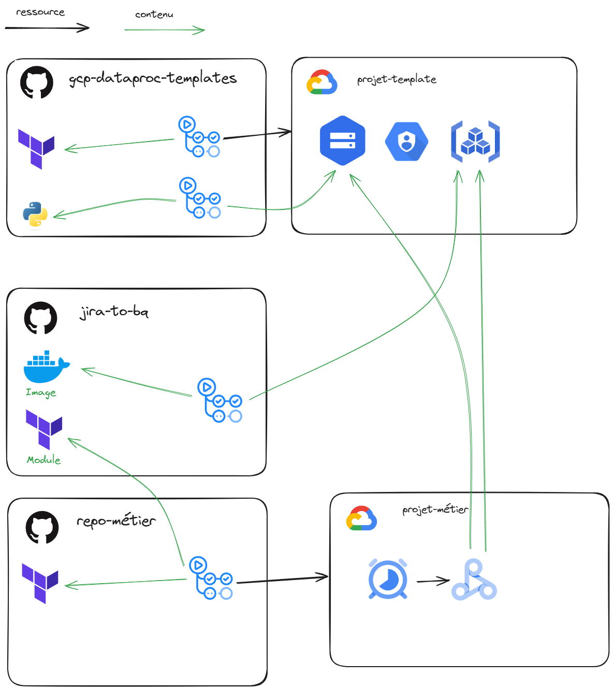

# Fonction export de l'api jira vers bigquery

Ce repo héberge :
- La custom image pour dataproc permettant d'exécuter la workload du script python jira-to-bq
- le workflow pour build et pousser l'image vers le artifact registry
- le module Terraform permettant qui permet en étant appelé depuis le repo métier d'instancier un cloud scheduler qui va déclencher des dataproc serverless

La workload en python est maintennue sur le repo gcp-dataproc-templates

